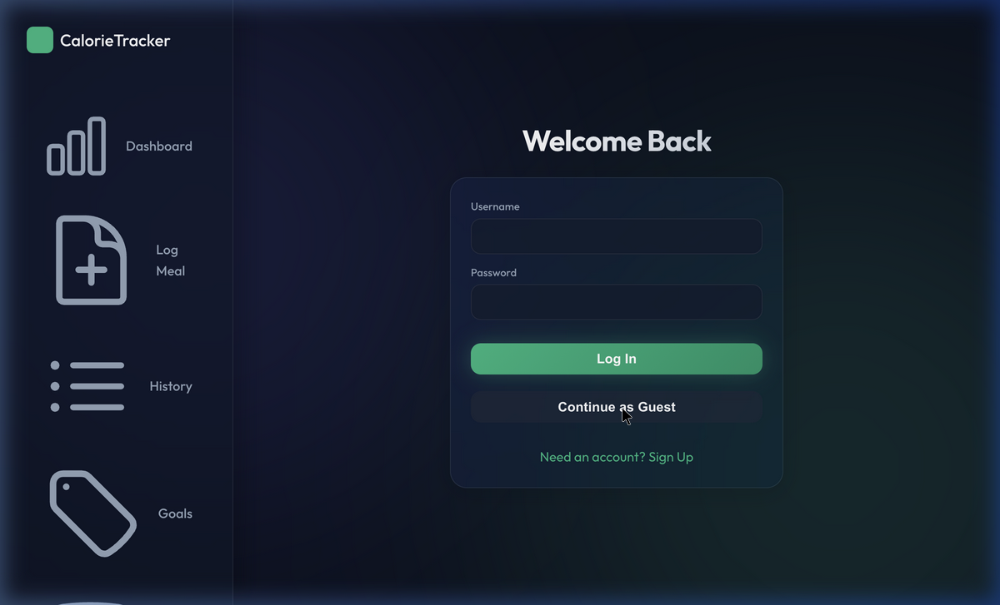
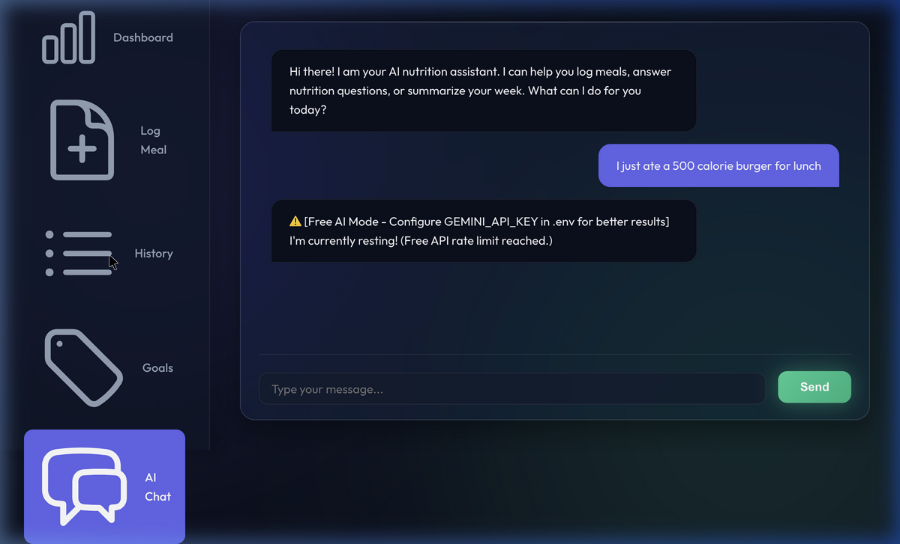

# AI Calorie & Nutrition Tracker

A modern, full-stack web application for tracking personal health goals and nutrition, powered by AI.

## Validation Video

Please review the attached session to see me acting as the LLM interface testing the Application, viewing inputs, and loading the PDF screens sequentially!


## Features Built
1. **Multi-User Dashboards:** Private data isolation across goals, meals, and reports.
2. **AI Meal Scanner:** Upload a photo of food to magically extract nutritional estimates and macros (Google Gemini or free open HuggingFace fallback).
3. **Conversational Agent:** Chat with a nutritionist AI that can automatically log meals for you straight to your database. (e.g., "I just ate a 500 calorie burger, log it!").
4. **Interactive Dashboard:** Dynamic charts rendering real-time macros and 7-day calorie trajectories. 
5. **Bulk PDF Imports:** Upload an exported PDF tabular diary to batch-insert daily logs.
6. **Config-Driven Architecture:** Managed entirely by a single `config.json` that bridges the backend API, frontend endpoints, and port allocations.

## Tech Stack
- **Frontend:** React + Vite, Tailwind CSS, Chart.js, Axios
- **Backend:** FastAPI, Python, SQLAlchemy, PyMuPDF, `google-generativeai`
- **Database:** SQLite (Default, defined in `config.json`)

## Configuration
Edit `config.json` in the root directory:
```json
{
    "database_url": "sqlite:///./calorie_tracker.db",
    "frontend_api_base_url": "http://localhost:8000/api",
    "backend_host": "0.0.0.0",
    "backend_port": 8000
}
```

## Running the Application

### 1. Start the Backend
```bash
cd backend
pip install -r requirements.txt
uvicorn main:app --reload --host 0.0.0.0 --port 8000
```
*(Optionally populate the `.env` file with `GEMINI_API_KEY=xxx` for accurate AI scanning)*

### 2. Start the Frontend
```bash
cd frontend
npm install
npm run dev
```

### 3. Test Bulk Imports
We've included a script to generate a sample PDF test file!
```bash
pip install reportlab
python generate_sample_pdf.py
```
This produces `sample_diary.pdf`. Upload this using the "Import Diary (PDF)" button on the "History" tab of the running web application.

---

# App Feature Walkthrough & Workflow Report

Below is a detailed workflow report demonstrating the finalized architecture, UI components, and the advanced capabilities of the Calorie Tracker application.

## 1. Multi-User Authentication

The application now supports isolated environments for multiple users. This ensures that goals, logged meals, and generated reports are strictly segregated by user ID using stateless JWT authentication.

*   **Login & Onboarding:** Users can securely create unique accounts or continue using the isolated "Guest" context. 
*   **Data Isolation:** The centralized SQLite database links every `MealEntry` and `Goal` securely via Foreign Keys, and the FastAPI automatically filters all `GET`, `PUT`, and `DELETE` requests utilizing the newly integrated `get_current_user` dependencies.



## 2. Advanced AI Conversational Agent

One of the most complex features is the custom-built **Agentic LLM Interface**. Instead of just answering questions, the bot actively uses "tools" to perform actions inside the application.

*   **Natural Language Meal Logging:** The AI context-awareness system monitors your daily goal and totals. When you state an intent (e.g., *"I just ate a 500 calorie burger for lunch"*), the LLM generates a hidden `__ACTION__ { "action": "LOG_MEAL", ...}` command packet.
*   **Execution Runtime:** The FastAPI server intercepts this action tag, executes the raw database queries automatically on your behalf, and returns a sanitized conversational reply.
*   **Fallback Resilience:** If the Google Gemini keys are missing, the UI gracefully falls back to the free HuggingFace API network for both Chat and Image scanning, alerting the user to the temporary status via warnings.



## 3. Bulk PDF Diary Imports

To accommodate users migrating data or managing spreadsheets, I created a robust Bulk PDF import flow explicitly integrated into the **History** viewing component.

*   **`PyMuPDF` Engine:** We leverage the high-performance `fitz` parser natively in Python on the FastAPI server to process uploaded documents locally.
*   **Regex Tabular Matching:** The Python parser processes every line of the document looking for exactly structured grids in the format: `YYYY-MM-DD | MealType | Food Name | Calories | Macros...`.
*   **Batch Imports:** As rows are extracted, they are verified and batch-inserted as new entries tied to the current user's JWT context. The UI alerts the user once the batch is flushed and automatically refreshes their history listing without requiring a page reload.

